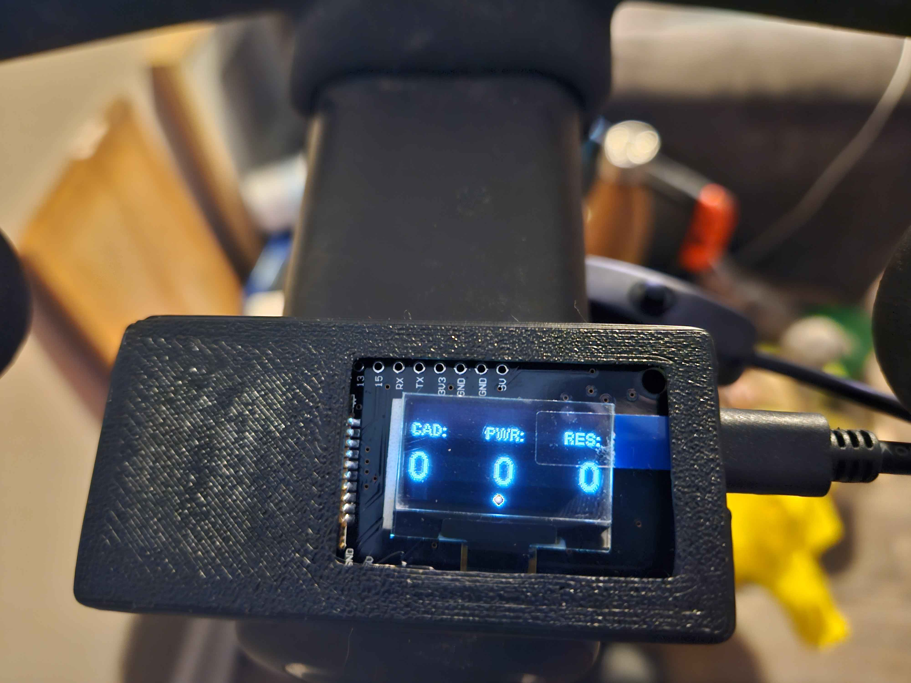

# Echelon To Garmin

This is a fork of https://github.com/snowzach/echbt

This is a Bluetooth client for the Echelon Sport stationary bike that can create activities for garmin connect. (Auto 
upload to garmin possibly comming soon) It does this by sending the information to a php server where its stored a 
processed by a python script to output a .fit file which when uploaded to garmin connect will show various graphs and
allow for tracking of workouts.

This project is a fork of another project and was created as the original board was not available in my country and the 
heltec drivers wouldn't work and appeared to be buggy.

It's written using Arduino and designed for this board: https://a.co/d/aAaFCNw but hypothetically any esp32 with an oled
using I2C will work

It scans and connects on startup for an Echelon Sport bike and connects automatically

It shows:
* Cadence
* Resistance
* Calculated Power

The resistance and power is roughly adjusted to be compatible with Peleton.

# Requirements
## ESP Libraries
1. "BLEDevice.h"
1. "device.h"
1. "power.h"
1. <WiFi.h>
1. <HTTPClient.h>
1. "time.h"
1. "esp_sntp.h"
1. "OLEDDisplayUi.h"
1. <Wire.h>
1. "SSD1306Wire.h"

## Python Libraries
1. [Fit_Tool](https://bitbucket.org/stagescycling/python_fit_tool/src/main/)

## Workflow

ESP 32 sends the data to a php file(https://ubuntu.com/server/docs/how-to-install-and-configure-php)
and running the echelon_rtb.php file. The echelon_rtb.php file creates a csv file that when inputed to the python script
the python ech2fit.py it will create a fit file that can be uploaded to garmin(Or really any service/program).

### Road Map
1. Workout time shown on screen
1. Restrict time of workouts so workouts are limited to x amount of time
1. Auto process activities
1. Auto-upload activities to Garmin

LICENSE:  This work is licensed under a <a rel="license" href="http://creativecommons.org/licenses/by-nc-sa/4.0/">Creative Commons Attribution-NonCommercial-ShareAlike 4.0 International License</a>.

